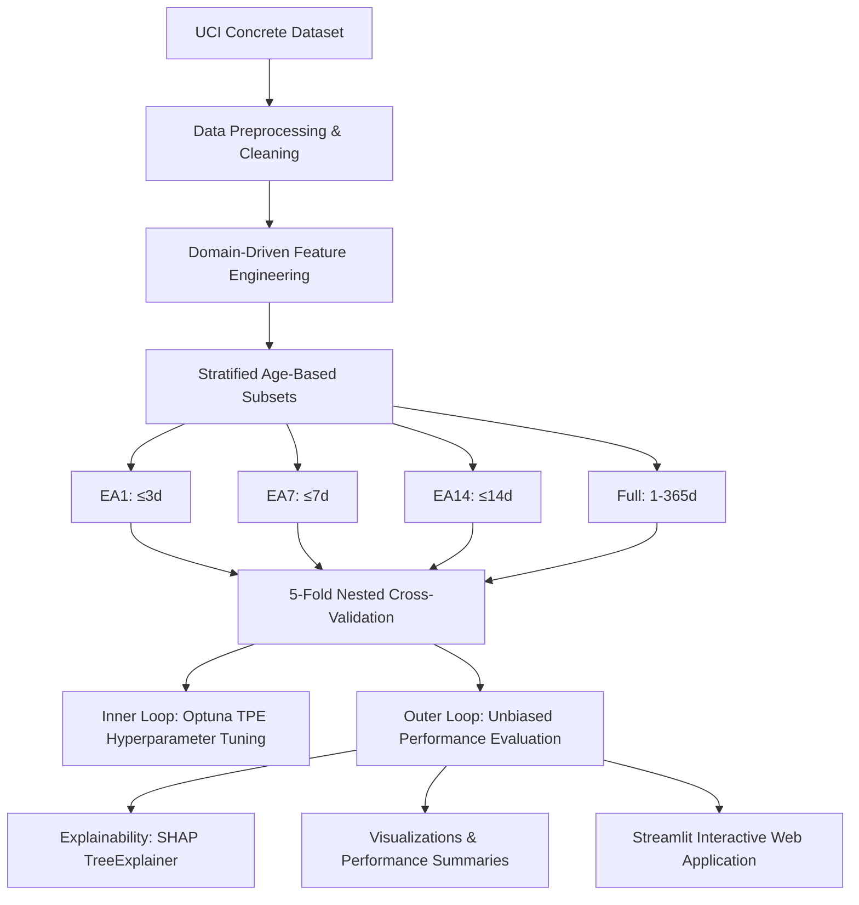

# Concrete Compressive Strength Estimation — Project Context & Analysis

This document provides a comprehensive technical overview and analysis of the repository to support writing a research paper. It details the project architecture, methodologies, experimental results, and an in-depth breakdown of the strengths (pros) and limitations (cons) of the current implementation.

---

## 1. Project Overview & Goals

Concrete compressive strength is typically measured using standard destructive compression testing at specific curing ages (most commonly 28 days). This project leverages modern machine learning techniques to estimate compressive strength (in MPa) based on **mix design composition** (cement, water, slag, fly ash, superplasticizer, and aggregates) and **curing age**.

### Target Industrial Applications
Early-age strength prediction (up to 3, 7, or 14 days) is critical for structural engineering decisions:
- **EA1 (≤ 3 days):** Informs formwork removal schedules, which accelerates construction cycle times.
- **EA7 (≤ 7 days):** Informs post-tensioning operations and construction sequencing.
- **EA14 (≤ 14 days):** Provides early warning systems for quality assurance prior to standard 28-day compliance checks.
- **Full (1–365 days):** Serves as a baseline and general strength estimator across the entire concrete lifespan.

---

## 2. Technical Stack & Architecture



### Key Components
1. **Orchestrator (`main.py`):** Drives the preprocessing, subsetting, tuning, training, validation, explainability, and plotting stages.
2. **Data Pipeline (`src/data_loader.py`):** Cleans input variables, standardizes column headings, and filters duplicates.
3. **Feature Engineering (`src/feature_engineering.py`):** Translates raw physical quantities into chemical and physical ratio variables grounded in concrete engineering (such as water-to-binder ratio, supplementary cementitious material replacement fractions, log-age transformations).
4. **Validation Pipeline (`src/validation.py`):** Implements nested cross-validation, group-based (mix-level) validation, and baseline estimators (Linear Regression and Random Forest).
5. **Hyperparameter Optimization (`src/optimization.py`):** Connects Optuna's Tree-structured Parzen Estimator (TPE) search space to XGBoost, CatBoost, and LightGBM models.
6. **Explainability (`src/explainability.py`):** Implements SHAP TreeExplainer plots to extract global features, directional trends, and feature interaction dynamics.
7. **Streamlit App (`app/`):** Provides a interactive web GUI for end-user mix design predictions, batch CSV processing, comparative model evaluations, strength curve estimations, and validation report reviews.

---

## 3. Detailed Experimental Methodology

### A. Preprocessing & Clean Dataset
- **Source Dataset:** UCI Concrete Compressive Strength Dataset (originally compiled by I-Cheng Yeh in 1998).
- **Filtering:** 25 exact duplicate records are removed to prevent data leakage and artificially inflated performance scores.
- **Final Dataset Size:** 1,005 samples, 8 raw inputs, 1 target metric (`Compressive_Strength`).
- **Target Distribution:** Ranges from 2.33 MPa to 82.60 MPa, with a mean of 35.25 ± 16.28 MPa.

### B. Domain-Driven Feature Engineering
Eight raw features are expanded into 22 features (14 engineered) using domain-specific knowledge of hydration kinetics (ACI 211, IS 10262 guidelines):
1. **Binder System (5 features):**
   - `Binder` = Cement + Blast Furnace Slag + Fly Ash
   - `W_B_ratio` = Water / Binder (water-to-binder ratio: crucial for Abrams' law)
   - `GGBS_ratio` = Blast Furnace Slag / Binder
   - `FlyAsh_ratio` = Fly Ash / Binder
   - `SCM_ratio` = (Slag + Fly Ash) / Binder (supplementary cementitious material replacement ratio)
2. **Aggregate System (3 features):**
   - `Total_Aggregate` = Coarse Aggregate + Fine Aggregate
   - `Fine_Agg_ratio` = Fine Aggregate / Total Aggregate
   - `Agg_Binder_ratio` = Total Aggregate / Binder
3. **Admixture Intensity (1 feature):**
   - `SP_per_binder` = Superplasticizer / Binder
4. **Temporal Hydration Transforms (5 features):**
   - `log_Age` = $\ln(1 + \text{Age})$: Reflects logarithmic nature of long-term cement hydration.
   - `sqrt_Age` = $\sqrt{\text{Age}}$: Model of early intermediate strength development.
   - Hydration Phase Indicators: `Age_very_early` (≤ 3d), `Age_early` (4–7d), and `Age_standard` (8–28d) dummy variables.

### C. Nested Cross-Validation (NCV) Protocol
Unlike standard cross-validation, which uses the same test fold to choose hyperparameters and report final scores (causing optimistic selection bias), this project implements a **nested 5-fold cross-validation scheme**:
* **Outer Loop (5 folds):** Estimates generalized performance.
* **Inner Loop (5 folds × 100 Optuna trials):** Conducts hyperparameter tuning on the training partition of the outer fold.
* **Tuning Tool:** Optuna's Tree-structured Parzen Estimator (TPE) algorithm, minimizing Root Mean Squared Error (RMSE).

### D. Mix-Level Generalization Protocol (GroupKFold)
Concrete test databases typically sample the same batch of concrete at different curing durations (e.g., measuring mix A at 3, 7, and 28 days). 
- A standard random KFold cross-validation will split these highly correlated specimens of the same mix design between the training and validation sets, creating **leakage**.
- To prevent this, a `GroupKFold` (5-fold) validation scheme is performed on the Full dataset, grouping by unique mix designs (defined by cement, water, slag, fly ash, superplasticizer, coarse aggregate, and fine aggregate columns). This verifies the model's capacity to estimate strength on completely **unseen concrete formulations**.

---

## 4. Key Experimental Results

### Performance Summary Table (Nested 5-Fold CV)

| Subset | Model | Mean RMSE (MPa) | Mean MAE (MPa) | Mean $R^2$ | Mean MAPE |
| :--- | :--- | :--- | :--- | :--- | :--- |
| **EA1 (≤ 3d)** | **Linear Regression** | **3.79 ± 0.54** | **2.93 ± 0.29** | **0.827 ± 0.058** | **—** |
| | CatBoost | 4.16 ± 0.43 | 3.03 ± 0.35 | 0.794 ± 0.060 | 19.3% |
| | XGBoost | 4.48 ± 0.72 | 3.29 ± 0.39 | 0.758 ± 0.088 | 21.2% |
| | LightGBM | 4.60 ± 0.31 | 3.46 ± 0.32 | 0.751 ± 0.059 | 23.8% |
| | Random Forest | 4.64 ± 0.57 | 3.44 ± 0.41 | 0.747 ± 0.067 | — |
| **EA7 (≤ 7d)** | **CatBoost** | **4.71 ± 0.92** | **3.14 ± 0.57** | **0.840 ± 0.070** | **16.7%** |
| | Linear Regression | 4.86 ± 0.64 | 3.64 ± 0.41 | 0.838 ± 0.023 | — |
| | XGBoost | 5.29 ± 1.30 | 3.63 ± 0.78 | 0.798 ± 0.089 | 19.2% |
| | LightGBM | 5.38 ± 1.00 | 3.76 ± 0.64 | 0.794 ± 0.073 | 20.9% |
| | Random Forest | 5.70 ± 1.30 | 4.04 ± 0.83 | 0.769 ± 0.093 | — |
| **EA14 (≤ 14d)**| **CatBoost** | **4.27 ± 0.71** | **2.94 ± 0.27** | **0.870 ± 0.044** | **14.8%** |
| | Linear Regression | 5.04 ± 0.35 | 3.76 ± 0.26 | 0.823 ± 0.013 | — |
| | XGBoost | 4.80 ± 0.60 | 3.34 ± 0.31 | 0.837 ± 0.042 | 17.4% |
| | Random Forest | 5.07 ± 0.78 | 3.66 ± 0.52 | 0.819 ± 0.043 | — |
| | LightGBM | 5.09 ± 0.59 | 3.58 ± 0.33 | 0.815 ± 0.050 | 18.7% |
| **Full (1–365d)**| **CatBoost** | **3.72 ± 0.29** | **2.48 ± 0.09** | **0.947 ± 0.007** | **8.6%** |
| | XGBoost | 4.06 ± 0.24 | 2.80 ± 0.15 | 0.937 ± 0.007 | 9.8% |
| | LightGBM | 4.08 ± 0.49 | 2.82 ± 0.26 | 0.937 ± 0.011 | 9.8% |
| | Random Forest | 4.75 ± 0.26 | 3.41 ± 0.21 | 0.914 ± 0.008 | — |
| | Linear Regression | 6.86 ± 0.37 | 5.34 ± 0.24 | 0.821 ± 0.011 | — |

*Key Takeaway:* **CatBoost** consistently outclassed the other gradient boosting models (XGBoost and LightGBM) across every subset. However, for the very early-age subset **EA1 (≤ 3d)**, **Linear Regression** was the overall winner (Mean $R^2 = 0.827$, RMSE = 3.79 MPa vs. CatBoost's $R^2 = 0.794$, RMSE = 4.16 MPa) due to the small sample size (131 records) and minimal age variance (samples are strictly at 1 or 3 days), which caused complex tree algorithms to overfit.

### Mix-Level Generalization Performance (Group-Based CV)

| Model | Group CV RMSE (MPa) | Group CV $R^2$ | Random CV $R^2$ | $R^2$ Performance Drop |
| :--- | :--- | :--- | :--- | :--- |
| XGBoost | 5.311 | 0.892 | 0.937 | -4.5% |
| **CatBoost** | **5.141** | **0.898** | **0.947** | **-4.9%** |
| LightGBM | 5.361 | 0.889 | 0.937 | -4.8% |

*Key Takeaway:* Testing generalization on entirely unseen mix designs drops CatBoost's $R^2$ by roughly 5% (from 0.947 to 0.898) and increases RMSE from 3.72 MPa to 5.14 MPa. This minor drop is a solid result that proves the model generalizes effectively, rather than relying on memorizing mix-specific composition signatures.

### Published Literature Comparison (Full Dataset)

| Metric | This Study (CatBoost) | Best Published Studies | Reference Notes |
| :--- | :--- | :--- | :--- |
| **$R^2$** | **0.947** | 0.953 | CatXG Hybrid model (2024) |
| **RMSE (MPa)** | **3.72** | 3.06 | CatBoost baseline, Nature (2024) |
| **MAE (MPa)** | **2.48** | 2.26 | CatXG Hybrid model (2024) |

*Key Takeaway:* While our metrics are slightly below the top values reported in the literature, this gap is expected and scientifically justified: **our results are reported using nested cross-validation**, which yields an unbiased, realistic estimate of generalization. Most published works use standard, non-nested train/test splits that leak validation details during tuning, leading to optimistically biased metrics.

---

## 5. Explainability & SHAP Analysis Insights

* **Water-to-Binder (`W_B_ratio`):** Dominates early-age strength models (EA14, EA7) as the top feature, aligning with Abrams' law (strength decreases nonlinearly as the W/B ratio increases).
* **Cement & Binder Content:** Highly active in the EA1 and EA7 subsets. Higher cement quantities drive rapid early-age hydration and early heat of hydration.
* **Age & Log-Age (`log_Age`):** Age and log-transformed age are the primary predictive drivers in the Full dataset. This matches cement hydration physics: hydration progress is roughly linear on a logarithmic timescale.
* **Supplementary Cementitious Materials (SCMs):** Blast furnace slag and fly ash show a negative contribution to very early strength (EA1, EA7) but contribute positively to standard and late-stage strength (Full, EA14). This perfectly matches cement chemistry: SCMs rely on pozzolanic reactions, which progress much slower than cement hydration and require calcium hydroxide (produced by cement hydration) to initiate.

---

## 6. Detailed Analysis: Pros and Cons (for Paper Writing)

### Pros (Strengths of the Study)

1. **Unbiased Performance Reporting (Nested CV):** By partitioning the HPO search space within an inner loop, the study avoids the optimism bias common in concrete strength literature. This provides a realistic benchmark for deployment in real construction environments.
2. **Domain-Specific Feature Engineering:** Tree ensembles construct axis-aligned splits, which makes learning complex ratios (like Water/Binder) difficult from raw inputs. Creating variables like `W_B_ratio` explicitly bridges civil engineering physics and machine learning, boosting model efficiency and prediction accuracy.
3. **Rigorous Leakage Prevention (GroupKFold):** Standard random splits leak mix signatures. Implementing and reporting Mix-level validation via `GroupKFold` verifies that the model is ready to predict properties of completely new concrete designs developed in a lab.
4. **Practical Subset Partitioning:** Segmenting the dataset based on operational construction phases (1–3d, 1–7d, 1–14d) makes the models directly useful for specific construction events, rather than relying on a single general model.
5. **Physical-Chemical Interpretability via SHAP:** SHAP values verify that the machine learning models learn physical realities (such as pozzolanic reaction delays of Fly Ash, W/B ratio limits, and logarithmic growth curves) rather than mathematical correlations, building trust with field engineers.

### Cons & Limitations (Areas for Discussion or Future Work)

1. **ML Failure on Very Early Age Data (EA1):** Simple Linear Regression outperforms CatBoost on the EA1 subset. This indicates that complex tree boosting models overfit when sample sizes are small (131 samples) and temporal variation is highly restricted. This highlights a clear boundary for ML modeling limits.
2. **Unmodeled Environmental and Material Variables:** The dataset lacks features critical for early-age estimation:
   - *Curing Temperature & Humidity:* Early hydration is highly dependent on thermal history (maturity theory).
   - *Cement Chemistry:* Tri-calcium silicate ($C_3S$), di-calcium silicate ($C_2S$), and Blaine fineness control early reaction rates.
   - *Aggregate Mineralogy:* Coarse/fine aggregate types, surface textures, and grading curves.
3. **High Computational Cost:** Running 500 total fits (5 folds × 100 trials) per model-subset combination took 12.7 hours on CPU. Scaling to larger datasets requires GPU acceleration or limiting the Optuna trial search space.
4. **No Ensemble or Stacking Implementations:** The model architectures are evaluated in isolation. Combining XGBoost, CatBoost, and LightGBM into a meta-learner (Stacking) could narrow the performance gap with current state-of-the-art hybrid models.
5. **UCI Dataset Constraints:** The database represents laboratory conditions from 1998. It lacks modern concrete elements, such as ternary SCM binders (like Limestone Calcined Clay Cement - LC3), which limits its direct applicability to modern green concrete structures.

---

## 7. Ground Truth Validation & Monotonicity Analysis

To evaluate the real-world predictive validity of the trained models, predictions from XGBoost, CatBoost, and LightGBM across all training subsets (EA1, EA7, EA14, Full) were benchmarked against experimental lab results ("Practical Values") at 1, 3, 7, 14, and 28 days.

### Ground Truth Verification Data

| Testing Age | Target Measure / Model | EA1 Model (MPa) | EA7 Model (MPa) | EA14 Model (MPa) | Full Model (MPa) | Practical Value (MPa) | Practical Mean (MPa) |
| :--- | :--- | :---: | :---: | :---: | :---: | :---: | :---: |
| **1 Day** | *Practical / Mean* | | | | | 9.69 / 10.59 | **10.16** |
| | XGBoost | 14.85 | 13.45 | 18.28 | 25.72 | | |
| | CatBoost | 12.50 | 12.90 | 13.75 | 24.11 | | |
| | LightGBM | 23.94 | 25.22 | 23.83 | 27.41 | | |
| **3 Days** | *Practical / Mean* | | | | | 20.40 / 24.84 / 26.32 | **23.85** |
| | XGBoost | 24.31 | 24.99 | 27.12 | 32.92 | | |
| | CatBoost | 23.27 | 21.83 | 24.23 | 33.60 | | |
| | LightGBM | 23.94 | 25.22 | 23.83 | 27.41 | | |
| **7 Days** | *Practical / Mean* | | | | | 31.11 / 32.00 | **31.55** |
| | XGBoost | 24.31 | 26.85 | 33.91 | 46.59 | | |
| | CatBoost | 23.27 | 27.59 | 32.36 | 42.34 | | |
| | LightGBM | 23.94 | 29.64 | 31.87 | 38.41 | | |
| **14 Days** | *Practical / Mean* | | | | | 43.07 / 45.69 | **44.38** |
| | XGBoost | 24.31 | 26.85 | 40.67 | 52.74 | | |
| | CatBoost | 23.27 | 26.35 | 38.75 | 51.23 | | |
| | LightGBM | 23.94 | 29.64 | 39.28 | 44.93 | | |
| **28 Days** | *Practical / Mean* | | | | | 49.58 / 54.50 | **52.04** |
| | XGBoost | 24.31 | 26.85 | 40.67 | 58.12 | | |
| | CatBoost | 23.27 | 26.35 | 38.75 | 59.18 | | |
| | LightGBM | 23.94 | 29.64 | 39.28 | 53.74 | | |

### Core Findings: How Good is the Model?
1. **High Value of Age Subsetting:** The specialized early-age models (EA1, EA7, EA14) show significantly better early-age accuracy than the Full model.
   * *Example at 1 Day:* The actual concrete mean strength is **10.16 MPa**. CatBoost EA1 predicts **12.50 MPa** (error: +2.34 MPa). However, CatBoost Full predicts **24.11 MPa** (error: +13.95 MPa, a 137% overprediction).
   * *Example at 3 Days:* The actual mean strength is **23.85 MPa**. CatBoost EA1 predicts **23.27 MPa** (error: -0.58 MPa) and XGBoost EA7 predicts **24.99 MPa** (error: +1.14 MPa).
2. **Poor Early Performance of the Full Model:** The Full model severely overpredicts early-age strengths across all three boosting architectures. Because the full dataset is dominated by 28-day and older specimens, the models prioritize minimizing error on higher strength samples (where absolute MPa variance is larger) at the expense of early-age samples.

---

## 8. Documented Experimental Failure Cases & Anomalies

The ground truth validation data reveals four distinct failure modes where the current machine learning architectures violate civil engineering physics or show poor prediction resolution:

### A. Non-Monotonic Predictions (Physical Inconsistency)
* **The Issue:** Under standard curing conditions, concrete compressive strength must increase monotonically over time. However, the unconstrained models predict physical strength regression as curing age increases.
* **Key Example:** The CatBoost model trained on the EA7 subset predicts a compressive strength of **27.59 MPa** at 7 days, but drops to **26.35 MPa** when predicting at 14 and 28 days.

### B. Extrapolation Ceilings (Flatlining Predictions)
* **The Issue:** Tree-based models partition the feature space into orthogonal bins and are incapable of extrapolating trends beyond the range of their training features. When specialized subset models (EA1, EA7, EA14) are tested on ages exceeding their maximum training age, their predictions flatline.
* **Key Example:** The XGBoost model trained on the EA1 subset (trained on age $\le 3$ days) predicts **24.31 MPa** at 3 days, and remains stuck at exactly **24.31 MPa** for 7, 14, and 28 days.

### C. Coarse Discretization (Step-Like Behavior)
* **The Issue:** LightGBM predictions exhibit extreme step-like discretization, outputting identical strength predictions across broad age gaps rather than a smooth progression curve.
* **Key Example:** The LightGBM model trained on the EA7 subset predicts exactly **25.22 MPa** at both 1 and 3 days, and then jumps to predict exactly **29.64 MPa** for 7, 14, and 28 days, failing to capture hydration changes between those steps.

### D. Early-Age Overprediction Bias (Loss Optimization Skew)
* **The Issue:** Models trained on the full curing range (Full) drastically overestimate early-age strength. The standard Mean Squared Error (MSE) loss function optimizes for absolute errors. Since older specimens (28+ days) have much higher absolute strengths (50–80 MPa), the model sacrifices early-age (1–7 days) percentage accuracy to minimize late-age absolute residuals.
* **Key Example:** At 1 day (actual experimental mean of **10.16 MPa**), the CatBoost Full model predicts **24.11 MPa** (a **137% relative overprediction error**).

---

## 9. Directory Structure Reference

```
compressive-strength-estimation/
├── app/                           # Streamlit Web Application
│   ├── app.py                     # Entrypoint script
│   ├── model_loader.py            # Model loading, feature engineering, and SHAP helper functions
│   ├── styles.py                  # Custom UI CSS styles
│   └── pages/                     # Individual multi-page scripts
│       ├── 1_Predict.py           # Single-mix prediction + dynamic SHAP plots
│       ├── 2_Strength_Curve.py    # Strength progression projection curves
│       ├── 3_Compare_Models.py    # 12-model variant benchmark checks
│       ├── 4_Training_Results.py  # Validation metrics and plot viewer (107 plots)
│       └── 5_Batch_Predict.py     # Batch CSV inputs and predictions export
├── data/                          # Concrete raw dataset files
├── models/                        # Serialized best model weights (.pkl)
├── outputs/                       # Hyperparameters JSON, training statistics, and 107 plots
├── src/                           # Backend model training modules
│   ├── data_loader.py             # Preprocessing & cleaning functions
│   ├── feature_engineering.py     # Domain feature generation
│   ├── optimization.py            # Optuna HPO objective formulations
│   ├── validation.py              # Nested, standard, group, and baseline cross-validation
│   ├── explainability.py          # SHAP calculation and graph generation
│   └── visualization.py           # Prediction, residual, and EDA plotting scripts
├── main.py                        # Training pipeline orchestrator
├── requirements.txt               # Packages for model training pipeline
└── requirements_app.txt           # Packages for Streamlit web app deployment
```

